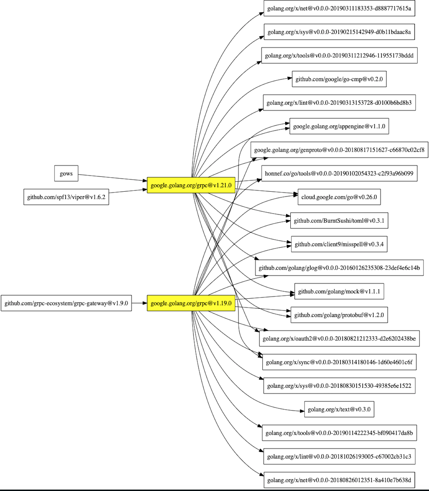

## modg

help command about `go mod graph` to be visualizing

### Preinstallation

#### macos

```shell script
brew install graphviz
go get github.com/sdw2330976/modg
```


### Demo

```shell script
modg -k google.golang.org/grpc | dot -T png | open -f -a /Applications/Preview.app

```

